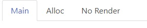
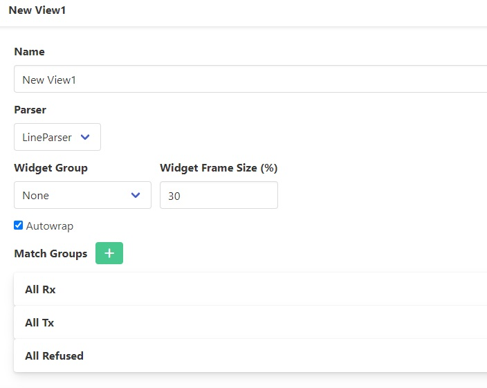
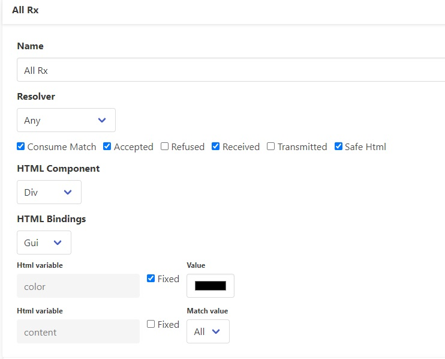
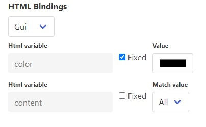
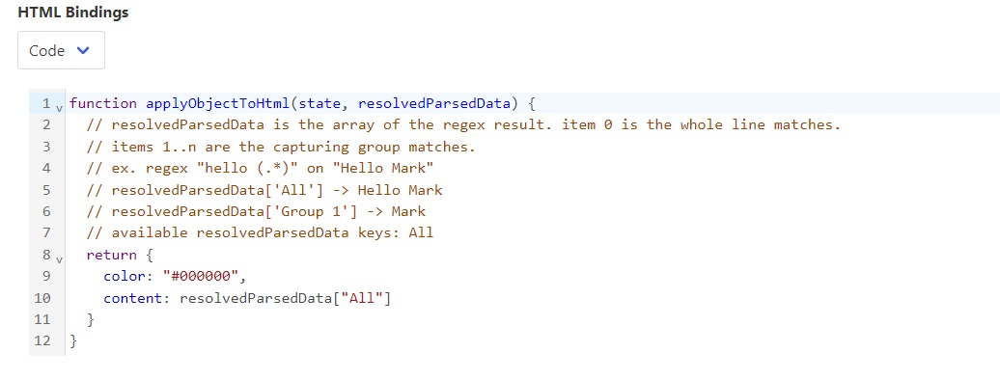
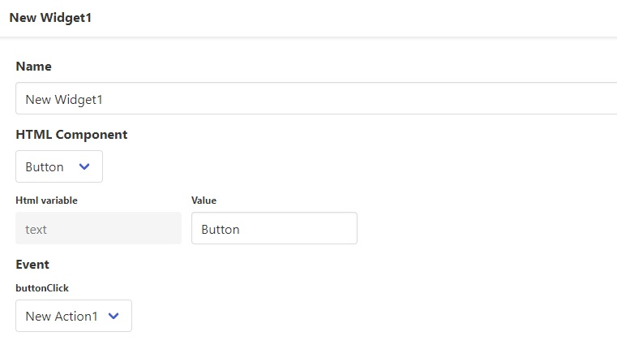
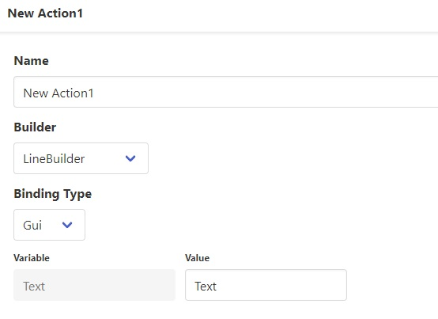
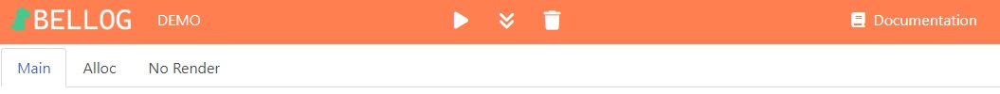

= BELLOG
:toc: left
:toclevels: 4
:sectnums:
:sectnumlevels: 4
:numbered:

[[Introduction]]
== Introduction

Bellog is tool designed to beutifly and filter any stream of text by setting a set of rules.

You can turn the usual ugly log file generated by a software or operative system into a easier to read format and also apply some logic to analyze logs of the same kind.

You can for example count the errors inside a log, filter only desired information, highlight error codes with colors, convert a binary stream into a JSON format and more.

Setting up the rules is quite easy and if you are a bit familiar with HTML and Javascript you can do incredible things with it.

Serial port option is also available to read stream of data from a COM port as well as setting rules for binary data and converting protocols like ModBus, CCTalk, PPP into a readable format.

[[Requirements]]
== Requirements

Either *Google Chrome* or *Edge* are required for WebSerial API (COM usage). +
Chromium derivates may also not work, for example Brave browser did not integrate the WebSerial API.

Mobile devices are also not supported.

[[Profile_structure]]
== Profile structure

Each set of rules is defined as *Profile*. +
A profile contains the following objects:

* <<Driver, Driver>>: The driver indicates where to receive the data to render.
* <<Parser, Parser>>: The parser is a function that accumulates the data received from the driver until it is consired valid. For example it waits until a newline is found.
* <<HTMLs, Custom HTMLs>>: Custom HTML object that can be rendered inside a View
* <<Views, Views>>: A list of views. A view renders the received test according to the provided matches
** <<Match_Groups, Matches>>: Each view contains a set of Matches. Matches connect a rule like matching a string, a Regex or any other logic, and renders the result into the desired HTML object.
* <<Widgets, Widgets>>: A widget is an object that can be optionally added to the sidebar of the view. It can be used to add informations like variables state or buttons to trigger Actions.
* <<Actions, Actions>>: An action is an event that can be triggered by interacting with some object like buttons. You can define a message to pass into a <<Builder, Builder>> so that it is sent to the driver.
* <<Builder, Custom Builders>>: After an action is triggered it can be possible to send data to the driver. As opposed to the Parser, the Builder creates that packet that should be sent.
* <<Parser, Custom Parser>>: A Parser defined by the User.
* <<Custom_JS_CSS, Custom JS scripts>>: Custom global JS scripts that can be used to add libaries, custom code or global variables.
* <<Custom_JS_CSS, Custom Stylesheets>>: Custom global stylesheet for giving styles to Custom HTMLs

[[Driver]]
=== Driver

The Driver indicates where to receive the data to render.
Currently the following Drivers are available:

* Clipboard: Paste the stream of data by pasting it with Ctrl-V. iF A Builder sends data to this Driver data is copied into the system clipboard.
* WebSerial: Receive and send data from a COM port. This feature is only available on Chrome and Edge.

[[Parser]]
=== Parser

The parser is a function that accumulates the data received from the driver until it is consired valid. For example it waits until a newline is found.
Currently the following Parsers are available:

* LineParser: Accumulate data until either a \r or \n is received.
* RawParser: Accept each character one by one without accumulating. If the Driver is sending binary data it will convert the byte into Hex string format. Each byte is separated by a space character to wrap on hex pairs.
* Custom Parser: A custom parser that can be defined by the user under the *Custom Parsers* section. An example a of Custom Parser is the following:

[source, javascript]
----
function(accumulator, data, onAccept, onRefuse, info) {
  // This is an example line parser. captures each sequence with terminating \n or \r
  // accumulator: use it to accumulate state of the parser then return it
  // data: Uin8tArray of received data
  // onAccept(accumulator, info): call this callback when accumulator is ready and has a valid sequence
  // onRefuse(accumulator, info): call this to refuse the sequence. Content may be displayed anyway according to view configuration
  // info: {isTx: boolean, driverName: string}
  var _accumulator = (accumulator === null || accumulator === undefined) ? "" : accumulator;
  const _data = String.fromCharCode.apply(null, data);
  for (let i = 0; i < _data.length; i++) {
    if (_data[i] == '\r' || _data[i] == '\n') {
      if (_accumulator.length > 0) {
        onAccept(_accumulator, info)
        _accumulator = ""
      }
    } else {
      _accumulator += _data[i]
    }
  }

  return _accumulator;
}
----
Either calling onAccepted or onRefused will pass the accumulated data to the views.

[[HTMLs]]
=== HTMLs

Every time some data is rendered it is put inside an HTML element and appended into the view.
By default the following HTMLs elements are available:

* Div: A simple div with a color that can be set, it terminates the line.
* Span: A simple span with a color that can be set, does not terminate the line. Useful to work with RawParser.
* Button: A button, designed to be used for widgets
* None: Renders nothing, cam be used to filter out data you don't want to see in the view.

A Custom Html object can be defined under the *Custom Html* section. An example is the following:

[source, html]
----

  

    ${$$title}
  

  

    ${$$content}
  

----

*title* and *content* are placeholers to be repleced with actual data during the view rendering. Placeholders must be aways present inside the literal expression ${}.

Additionally https://bulma.io/[Bulma CSS library] is bundled in the application so it can be possible to use any css from bulma inside your Custom Html.
Check <<Bundled_Libraries, Bundled Libraries>> for more info.

*Important:* A Custom Html object MUST have a single root element as outmost parent.

[[Views]]
=== Views

This is what actually renders the data to screen. You can define a list of view each containing rules that describe how the data shall be rendered.

Each flow of data is passed to each view according to the selected <<Parser, Parser>>. Each view is isolated and does not influence the others.
Each view will have it's own page inside the runtime page.
For example you may filter only strings containing errors in a view, and another view containing everything.

So a View is composed by:

* <<Parser, Parser>>: Describes how the data received from the driver is parsed
* <<Widgets, Widget Group>>: A view can also display at the left side a list of Widgets.
<<Widgets, Widgets>> can be used to add Button to trigger action and send data, or to display and update variables received from the stream.
* Flags:
** Autowrap: Wrap displayed data in the view if it overflows. If enabled data will go to a nw line, if disabled the horizontal scrollbar will be enabled.

[[Match_Groups]]
==== Match Groups

Each view has its own set of rules, a set of rules is called Match Group. +
A Match Groups is composed by:

[width="100%",options="header,footer", cols="1,2a"]
|===
| Field | Description  
| Resolver | Indicates how the data received from a Parser is filtered.
| Flags |

[options="header,footer"]
!===
! Flags ! Description
! Consume match !  If a match is found, consume it. No other match will be calculated.
Matches are calculated following the displayed order of Match Groups.
! Accepted !  Capture accepted parse result or refused parse result according to custom parsed callback calls. (onAccepted). Non-custom parsers automatically call onAccepted.
! Refused !  Capture refused parse result according to custom parsed callback calls. (onRefused)
A refuse may also be triggered by an internal exception.
! Received !  Capture received data from parser
! Transmitted !  Capture data trasmitted by some builder (ex. Triggered by a button widget)
! Safe HTML !  Escape strings before rendering. Prevents XSS security vulnerability but may be useful for some application.
!===

| Html Component |  Describe which html to use for rendering the resolved data
| Html Bindings |  Describe how to render the resolved data.
|===

[[Resolver]]
===== Resolver

Indicates how the data received from a Parser is filtered. +
Can be:

** StartWith: Accept data is starts with the string
** Contains: Accept data if it contains the string
** EndsWith: Accept data if it ends with the string
** Regex: Accept the whole parsed block if there is at least a match with the Regex. Capturing groups can also be used to group up some informations.
** Any: Accept anything
** ObjectCompare: Custom function to compare the data as you like. Mostly useful for binary data.

Example of Object compare function:
[source, javascript]
----
function customObjectCompare(state, parsedData, info) {
    // state: can be set to keep persistent state between compares.
    // parsedData: string or object according to parser usage
    // info: {isTx: boolean, driverName: string}
    // retrun an object with key pair of items to render and result status
    // keys must always be present when the function returns
    if(parsedData) {
        if (typeof parsedData === "string") {
            if(parsedData.toLowerCase().indexOf("error") > 0)
            {
                return {
                    result: true, 
                    data: {field1: "field1", field2: parsedData}
                }
            }
        } else {
            // field errorFlag may not exist depending on your parser implementation
            // TODO replace with the fields you are providing from the parser
            if(parsedData.errorFlag === true)
                return {
                    result: true, 
                    data: {field1: "field1", field2: parsedData.errorString}
                }
        }
    }
    // Dummy result is used by setup for previewing available html bindings
    return {result: false, data: {field1: "", field2: ""}}
}
----

**Note**: If the Parser provides an object instead of a string all Resolvers except 'ObjectCompare' will convert the object to a string format before comparing it.

[[Html_Bindings]]
===== Html Bindings

After choosing a Resolver an Html element must be chosen.
It can be either a defult one like a Div or a Span to render a simple line of text, or a more complex one defined as a Custom Html element.
Both custom and bundled html elements have a set of placeholders used to put the matched data.
Placeholder must be binded with the Reolver output, either in *Gui* or *Code* mode.

In *Gui* mode you can assign placeholders to a valid object provided by the resolver. Using the __Fixed__ it is possible to write a fixed value that does not depent on the resolver.

*Code* mode works the same way but you can add additional manipulation or render variables not related to the resolver.
The comment *available resolvedParsedData* provides a list of the valid keys of __resolvedParsedData__ object.

[[Widgets]]
=== Widget Groups

A list of widget can be defined to provide custom elements on the left of a <<Views, View>>.

Placeholders are always bound to fixed value for Widgets.
Html elements can have a custom attribute used to bound html event to an <<Actions, Action>>.

See for example the button implementation:

[source, html]
----
<button data-iwclick='buttonClick' class='button is-primary'>${$$text}</button>
----

Available custom attributes are the following:

* data-iwclick: Bind an onClick event to an Action

[[Actions]]
=== Actions

An Action can be triggered by a Widget to send some data thorugh the Driver. +
In the future it may also be added the possibility to trigger an Action via Timers or Manually.

An Action is composed by:

[[Builder]]
* Builder: Describes how te data shall be composed before sending it to the driver. Can be:
** LineBuilder: Data is sent to the builder as a line with \r\n newline termination.
** HexStringBuilder: Data is sent to the driver as a uint8array object after converting the hex string.
** Custom Builder: A custom builder can be defined in the *Custom builders* section like this:

[source, javascript]
----
function() {
  // List all argument required to create a packet to send
  // Bus address, data payload, command code etc
  const builderArgs = {
    prefix: "",
    msg: ""
  }

  function builderFunc(args) {
    // Can be either a string or Uint8Array
    return args.prefix + ": " + args.msg + "\r\n"
  }

  return [builderArgs, builderFunc];
}
----

* Binding: Binds the different fields we want to send to the builder. Useful for Custom Builders. +
If for example we must build a packet for a complex protocol a packet may have fields like ID, SubID, Sequence and more. From the Binding we provide the values and the Builder will merge them and do additional operation like appending a checksum or adding a timestamp. 

[[Custom_JS_CSS]]
=== Custom JS and CSS

Inside *Custom Global Script* and *Custom style* sections is possible to add any script, style or library you like.

It will be copied inside the header of the webpage when the Profile is run and also inside the setup page. This means that any javascript variable or function has a global context and may be called from any code of other custom objects.

If you need tips for debugging the code check <<Debugging, Debugging>> chapter.

[[Settings]]
=== Settings

Some additional settings can also be configured:

* *Share data between views*: If enabled data is always delivered to all the views. if disabled only the focused view receives data.
* *Maximum items per views*: Each view can only render up to N html elements.

[[Debugging]]
= Debugging

If you are writing custom object with javascript you may be wondering how to debug it.

* Use the console.log() and any other api of the console object.
* Write debugger; inside the code to trigger a breakpoint as soon as that code is being executed.

[source, javascript]
----
console.log("STEP 1")
debugger; // Browser will stop here with debugger
console.log("STEP 2")
----

After getting where you want with the debugger you can also check the call stack and read the source code to debug at a lower level.

[[Runtime]]
== Runtime

The Runtime is the page that parses the profiles, builds the desired build and receives the data from the <<Driver, Driver>>.

Depending on the driver a series of button will be available on the Toolbar.

* Play button: Active with WebSerial driver to open a COM port
* Double arrow-down button: Will lock the page to the bottom for receiving big streams of data
* Trash button: Clears the log from the views

[[Bundled_Libraries]]
== Bundled libraries

Some libraries are bundled by default into Bellog.

* https://bulma.io/[Bulma CSS Framework]

[[FAQ]]
== FAQ

*Can I trigeer an Action with Timers?* +
Not yet.

*Can I trigeer an Action after receiving a sequence?* +
No, maybe in the future.

*How can I backup the logs?* +
Currently you can copy and paste the data from the view by doing Ctrl+A and Ctrl+C.
In the future i want to add the possibility to export an html file with the html rendered view.

*Can I create a custom Driver?* +
No, but i want to add a 'Backend' driver where an user can use a backend application to provide data from other peripherals (ex. Netowork, CAN BUS, etc).
